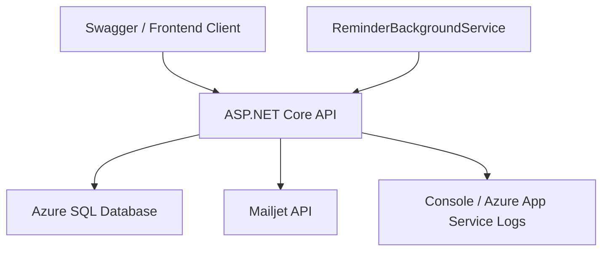

# 系統架構

## 目標

此專案是面試 Demo 用的 backend-first 系統，因此架構重點放在：

- 讓面試官看得懂模組邊界
- 讓 API 能直接從 Swagger 被操作
- 讓部署、測試、seed data、背景工作都有完整故事

## 架構選擇

- Pattern: 模組化單體
- Runtime: ASP.NET Core Web API (.NET 8)
- Auth: ASP.NET Core Identity + JWT access/refresh token
- Data: EF Core + Azure SQL Database
- Background work: `BackgroundService`
- Docs/Discovery: Swagger + XML comments

## 分層責任

- `Api`
  負責 HTTP endpoints、授權屬性、Swagger、host pipeline
- `Application`
  定義 service contracts、result types、協作界面
- `Domain`
  定義 entity、enum、核心商業規則
- `Infrastructure`
  EF Core、Identity、JWT、seed、通知、背景工作、service 實作
- `Contracts`
  API request/response DTO

## 主要模組

- Auth
  登入、refresh、logout、目前使用者資訊
- Registration
  查詢週登記、更新週登記、套用上週、統計摘要
- Route
  路線、站點、老師指派
- Attendance
  建立點名 session、點名更新、完成 session
- Notification
  週四/週五自動提醒、手動提醒、通知歷史
- Admin
  跨路線調度、全域廣播、報表匯出

## 部署架構

## 設計重點

- 路線與方向分開建模，讓上學與放學路線可獨立維護
- 老師只看到自己被指派的路線
- 手動提醒與背景提醒共用同一個 notification service
- 報表先用 CSV，避免在 v1 引入不必要格式處理複雜度
