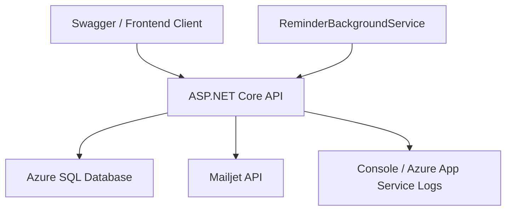

# 校車管理系統完整專案文件

## 文件目的

這份文件是本專案的完整總說明書，將原本分散在多份文件中的資訊整理成單一入口，方便以下使用情境：

- 面試時提供給面試官快速理解專案全貌
- 作為作品集中的正式專案說明文件
- 交給 NotebookLM、Gemini 或其他 AI 工具生成簡報、影片腳本與摘要
- 作為後續開發、維護與交接時的基礎文件

本文件整合的主題包含：

- 專案需求說明
- 角色與功能流程
- 資料庫設計與資料模型
- API 文件與端點說明
- 技術架構與模組責任
- 驗證授權、測試與執行方式

## 文件結構

1. 專案總覽
2. 需求說明文件
3. 角色與使用情境
4. 功能需求與系統流程
5. 資料庫文件
6. API 文件
7. 技術架構文件
8. 測試與品質保證
9. Demo 與使用方式
10. 相關文件索引

## 一、專案總覽

### 專案名稱

School Shuttle Bus Backend

### 一句話介紹

這是一套以 `ASP.NET Core 8` 建置的校車管理後端系統，針對學校情境設計了每週搭車登記、教師車上點名、管理端路線管理、跨路線調度、通知提醒與報表匯出等能力，並可直接透過 Swagger 展示完整角色流程。

### 專案定位

本專案是一個 `backend-first` 的展示型作品，重點不是只做出 API，而是做出一個：

- 有明確商業情境的系統
- 有清楚角色權限邊界的系統
- 有可展示資料與可操作流程的系統
- 有工程結構、測試與文件支撐的系統

### 專案目標

本專案的目標包括：

- 解決學校校車管理中常見的搭乘登記、點名、路線與通知問題
- 讓不同角色都能在同一套系統中使用對應功能
- 讓 API 可以直接透過 Swagger 被驗證與展示
- 讓專案具備可說明、可測試、可維護的工程品質

### 主要技術棧

- Runtime: `.NET 8`
- Framework: `ASP.NET Core Web API`
- Auth: `ASP.NET Core Identity + JWT`
- ORM: `Entity Framework Core`
- Database: `Azure SQL Database`
- Logging: `Serilog`
- API Docs: `Swagger + XML comments`
- Test: `xUnit + FluentAssertions + WebApplicationFactory + SQLite in-memory`

## 二、需求說明文件

### 2.1 問題背景

學校校車管理通常會面臨以下問題：

- 家長或學生每週都需要重複填寫搭車需求
- 教師在車上點名時需要快速確認未到學生與家長聯絡方式
- 管理端需要即時處理臨時調度、公告通知與報表需求
- 同一個系統中會有學生、家長、教師與管理員四種不同角色
- 不同角色的資料可見範圍與可操作權限並不相同

本專案就是針對這些實際需求，把資料模型、授權邊界與操作流程一併設計完整。

### 2.2 系統服務對象

- 學生
- 家長
- 教師
- 管理員

### 2.3 需求目標

系統需要支援以下核心能力：

- 每週搭車登記
- 套用上一週設定
- 路線與停靠站維護
- 教師路線指派
- 當天點名場次建立與點名更新
- 臨時跨路線調度
- 提醒通知與公告
- 報表匯出與下載

### 2.4 功能性需求

#### 身分驗證與授權

- 使用 `account + password` 登入，而不是單純 email
- 學生使用學號登入
- 教師與管理員使用工號登入
- 家長使用手機號碼登入
- 登入後取得 access token 與 refresh token
- API 依角色限制操作權限

#### 每週搭車登記

- 以週為單位管理搭車排程
- 以天為最小操作單位
- 每天可分別設定上學與放學是否搭乘
- 上學與放學可對應不同路線
- 可複製上一週設定以降低重複輸入
- 可統計已登記次數與實際出席次數

#### 路線管理

- 建立路線
- 更新路線基本資料
- 維護停靠站順序
- 支援一般路線與 Door-to-Door 路線
- 指派教師到指定路線

#### 點名流程

- 教師可根據搭車登記建立點名 session
- 教師可更新每位學生的點名狀態
- 點名完成後可將 session 標記為完成
- 點名資料保留緊急聯絡電話快照

#### 調度與管理功能

- 管理員可建立單次調度覆寫
- 管理員可發送全域公告
- 管理員可執行提醒作業
- 管理員可產出與下載報表

### 2.5 非功能性需求

- API 必須可直接透過 Swagger 展示
- 專案需具備分層與模組化結構
- 資料存取需可透過 EF Core migration 管理
- 啟動後需能自動 seed demo data
- 需具備基本測試覆蓋
- 需支援健康檢查與日誌輸出

## 三、角色與使用情境

### 3.1 管理員

管理員是系統中權限最高的角色，主要負責整體校車營運管理。

#### 可使用功能

- 取得學生與教職員 lookup 資料
- 建立調度覆寫
- 發送廣播通知
- 建立報表
- 下載報表
- 手動執行提醒
- 查看通知歷史
- 建立與更新路線
- 維護站點與教師指派

#### 典型使用情境

- 某位學生臨時需要改搭其他路線
- 管理端需要通知特定群體或全校使用者
- 需要匯出搭乘資料供行政統計

### 3.2 教師

教師負責實際車上營運流程，尤其是點名。

#### 可使用功能

- 查看自己可見的路線
- 查看可見點名 session
- 建立點名 session
- 更新點名紀錄
- 完成點名 session

#### 典型使用情境

- 出車前根據當日登記名單建立點名場次
- 上車時逐筆勾選學生是否到車
- 針對未到學生查看保留的緊急聯絡資訊

### 3.3 家長

家長是週期性使用者，主要負責替孩子管理每週搭車安排。

#### 可使用功能

- 查詢一週搭車資料
- 更新一週搭車設定
- 複製上一週設定
- 查看孩子搭乘摘要

#### 典型使用情境

- 每週安排孩子上學與放學是否搭車
- 下週行程與本週相同時直接複製設定
- 查看已登記次數與實際出席次數

### 3.4 學生

學生角色主要用於查看個人搭車資訊，作為自助查詢角色。

#### 可使用功能

- 查詢自己的週登記資料
- 查詢自己的搭乘摘要
- 透過前端啟動上下文取得個人角色資訊

## 四、功能需求與系統流程

### 4.1 系統主流程

這個系統可以被理解成一條完整的校車營運流程：

1. 家長或學生先完成每週搭車登記
2. 管理員建立或維護路線與教師指派
3. 如有臨時異動，管理員建立調度覆寫
4. 教師在搭車當天建立點名 session
5. 教師逐筆更新學生狀態
6. 管理員查看通知、提醒與報表資料

### 4.2 每週登記流程

#### 流程說明

- 指定週一作為 `weekStart`
- 讀取一週五天的搭車資料
- 針對每一天設定上學與放學是否搭乘
- 視需要指定上下學不同路線
- 若下週與本週相似，可直接複製上一週設定

#### 重要設計點

- 以週為主單位比以單日為主更貼近校務操作
- 可降低重複輸入
- 有助於與提醒機制整合

### 4.3 點名流程

#### 流程說明

- 教師先取得自己可見的路線
- 根據路線、日期與方向建立點名 session
- 系統依搭車登記資料產生點名名單
- 教師逐筆更新學生狀態
- 完成後將 session 標記為完成

#### 重要設計點

- 點名資料不是獨立存在，而是由登記資料驅動
- 點名紀錄保留當時的聯絡資訊快照
- 教師只會看到與自己綁定的路線

### 4.4 調度流程

#### 流程說明

- 管理員選擇學生、日期、方向與替代路線
- 系統建立單次調度覆寫
- 調度資訊只影響指定時段與指定方向

#### 重要設計點

- 單次覆寫比直接修改學生預設路線更安全
- 避免影響長期資料設定

### 4.5 通知與提醒流程

#### 流程說明

- 管理員可手動執行提醒作業
- 系統也支援背景提醒服務
- 通知寄送後保留 delivery 紀錄
- 管理端可查詢通知歷史

#### 重要設計點

- 手動提醒與背景提醒共用同一組通知能力
- 若未啟用正式郵件供應商，可退回 demo/log 模式

## 五、資料庫文件

### 5.1 資料庫選型

本專案目前使用 `Azure SQL Database` 作為正式資料庫，原因包括：

- 與 `.NET` 與 `EF Core` 整合成熟
- migration 管理方便
- 適合展示關聯式資料模型
- 與 Azure 雲端部署故事一致

測試環境則使用 `SQLite in-memory`，讓整合測試執行更快且可重現。

### 5.2 核心資料表

#### 身分與授權

- `AspNetUsers`
  Identity 使用者主表
- `AspNetRoles`
  角色資料
- `RefreshTokens`
  refresh token 儲存表

#### 人員資料

- `Students`
  學生基本資料、學號、年級、預設路線等
- `Guardians`
  家長資料、電話、email 等
- `StaffProfiles`
  教師與行政人員資料、工號與權限
- `StudentGuardianLinks`
  學生與家長關聯

#### 營運資料

- `Routes`
  路線主檔
- `RouteStops`
  路線停靠站與順序
- `RouteAssignments`
  路線與教師指派
- `RideRegistrations`
  每日上學與放學搭車登記
- `AttendanceSessions`
  點名場次
- `AttendanceRecords`
  單一學生點名結果
- `DispatchOverrides`
  臨時調度覆寫

#### 通知與報表

- `NotificationJobs`
  單次通知任務
- `NotificationDeliveries`
  寄送明細
- `BroadcastAnnouncements`
  廣播公告
- `ReportExports`
  已產出的報表
- `AuditLogs`
  稽核資料

### 5.3 關聯摘要

- `Students` 1..n `RideRegistrations`
- `Students` 1..n `AttendanceRecords`
- `Students` n..n `Guardians` via `StudentGuardianLinks`
- `Routes` 1..n `RouteStops`
- `Routes` 1..n `RouteAssignments`
- `Routes` 1..n `AttendanceSessions`
- `AttendanceSessions` 1..n `AttendanceRecords`
- `NotificationJobs` 1..n `NotificationDeliveries`

### 5.4 重要資料模型設計

#### Students

學生是整個系統的重要主體，對應：

- 每週搭車登記
- 點名紀錄
- 家長關聯
- 預設路線

#### Guardians

家長與學生是多對多關係，透過 `StudentGuardianLinks` 關聯，這讓系統可以保留：

- 一位家長對多位學生
- 一位學生對多位家長
- 主要聯絡人的設定

#### Routes

路線被設計成獨立於方向與站點的主檔，重要欄位概念包括：

- 路線名稱
- 校區名稱
- 上學或放學方向
- 一般或 Door-to-Door 類型
- 是否啟用

#### RideRegistrations

這是每週登記的核心表，重要概念包括：

- 綁定學生
- 綁定日期
- 綁定方向
- 是否登記搭乘
- 實際是否出席
- 對應路線

#### AttendanceSessions 與 AttendanceRecords

點名資料拆成兩層：

- `AttendanceSessions`
  表示一次點名場次
- `AttendanceRecords`
  表示場次中的單一學生紀錄

這種設計有助於：

- 管理一次點名的完整上下文
- 控制場次是否完成
- 保留逐筆點名結果

### 5.5 Seed Data

專案啟動時會自動建立可展示的 demo data，包含：

- 管理員、教師、家長、學生各一組帳號
- 一位學生與其家長關聯
- 管理員與教師 staff profile
- 上學、放學與 Door-to-Door 路線
- 一週搭車登記資料
- 提醒功能所需通知模板

建議展示週次為 `2026-03-16`。

## 六、API 文件

### 6.1 API 設計原則

- 採用 RESTful API
- 以角色授權控管資料範圍
- 透過 DTO 隔離內部實體與外部契約
- 錯誤回應統一使用 `ProblemDetails`
- Swagger 已內建 Bearer Token 驗證

### 6.2 驗證與登入 API

#### `POST /api/auth/login`

用途：

- 使用 `account + password` 登入

Request：

```json
{
  "account": "E0001",
  "password": "P@ssw0rd!"
}
```

Response 重點：

- `userId`
- `email`
- `accessToken`
- `refreshToken`
- `expiresAtUtc`

#### `POST /api/auth/refresh`

用途：

- 使用 refresh token 換發新的權杖組

#### `POST /api/auth/logout`

用途：

- 註銷目前登入者所有仍有效 refresh token

#### `GET /api/auth/me`

用途：

- 取得目前登入者的基本身分與角色資訊

Response 重點：

- `userId`
- `email`
- `roles`

#### `GET /api/auth/context`

用途：

- 回傳前端啟動所需的上下文資料

Response 重點：

- `displayName`
- `students`
- `staffProfile`

這個端點特別適合前端使用，因為它能一次取得：

- 目前角色資訊
- 可存取學生清單
- 教職員摘要資料

### 6.3 每週登記 API

#### `GET /api/registrations/weeks/{weekStart}?studentId={studentId}`

用途：

- 查詢指定學生目標週次的搭車資料

Response 重點：

- `studentId`
- `studentName`
- `weekStart`
- `days`
- `hasSubmittedWeek`

#### `PUT /api/registrations/weeks/{weekStart}`

用途：

- 更新指定學生當週搭車安排

Request 重點：

- `studentId`
- `days`
- 每日上學與放學是否搭乘
- 上下學路線 ID

#### `POST /api/registrations/weeks/{weekStart}/copy-last-week?studentId={studentId}`

用途：

- 將上一週設定複製到指定週次

#### `GET /api/registrations/students/{studentId}/summary`

用途：

- 查詢學生搭乘摘要

Response 重點：

- `registeredTrips`
- `presentTrips`
- `stage`

### 6.4 路線 API

#### `GET /api/routes`

用途：

- 取得目前登入者可查看的路線

#### `POST /api/routes`

角色限制：

- 管理員

用途：

- 建立路線主檔

#### `PATCH /api/routes/{routeId}`

角色限制：

- 管理員

用途：

- 更新路線基本資料

#### `POST /api/routes/{routeId}/stops`

角色限制：

- 管理員

用途：

- 覆蓋指定路線的停靠站清單

#### `POST /api/routes/assignments/{routeId}`

角色限制：

- 管理員

用途：

- 指派教師到指定路線

### 6.5 點名 API

#### `GET /api/attendance/sessions`

用途：

- 取得目前登入者可查看的點名場次

#### `POST /api/attendance/sessions`

角色限制：

- 教師、管理員

用途：

- 根據路線、日期與方向建立點名場次

Request：

```json
{
  "routeId": "route-guid",
  "date": "2026-03-16",
  "direction": "ToSchool"
}
```

#### `PATCH /api/attendance/records/{recordId}`

角色限制：

- 教師、管理員

用途：

- 更新單一學生點名狀態

#### `POST /api/attendance/sessions/{sessionId}/complete`

角色限制：

- 教師、管理員

用途：

- 將點名場次標記為完成

### 6.6 通知 API

#### `POST /api/notifications/reminders/run`

角色限制：

- 管理員

用途：

- 手動執行提醒作業

Response 重點：

- `notificationJobId`
- `deliveryCount`

#### `GET /api/notifications/history`

角色限制：

- 管理員

用途：

- 查詢通知寄送歷史

### 6.7 管理端 API

#### `GET /api/admin/lookups`

角色限制：

- 管理員

用途：

- 取得學生與教職員 lookup 資料

#### `POST /api/admin/dispatches`

角色限制：

- 管理員

用途：

- 建立單次調度覆寫

#### `POST /api/admin/broadcasts`

角色限制：

- 管理員

用途：

- 發送廣播公告

#### `POST /api/admin/reports`

角色限制：

- 管理員

用途：

- 建立報表檔案

#### `GET /api/admin/reports/{reportId}`

角色限制：

- 管理員

用途：

- 下載先前建立的報表內容

### 6.8 Bearer Token 使用方式

Swagger 已內建 Bearer Token 驗證機制。使用流程如下：

1. 先呼叫 `POST /api/auth/login`
2. 複製回傳的 `accessToken`
3. 開啟 Swagger 右上角 `Authorize`
4. 貼上 `Bearer <accessToken>`
5. 即可測試受保護端點

## 七、技術架構文件

### 7.1 架構風格

本專案採用 `模組化單體` 設計。

原因包括：

- 面試展示更重視模組責任是否清楚
- 校車流程彼此關聯高，拆成多服務反而增加複雜度
- 先用單一部署單位做出完整流程，再考慮未來拆分

### 7.2 分層責任

#### Api

- 負責 HTTP endpoints
- 負責授權屬性
- 負責 Swagger、ProblemDetails、CORS 與 host pipeline

#### Application

- 定義 service contracts
- 定義結果型別
- 處理協調層邏輯
- 包含調度衝突檢查等跨模組規則

#### Domain

- 定義 entity
- 定義 enum 與核心商業規則
- 保持對基礎設施的低依賴

#### Infrastructure

- 實作 EF Core 與 DbContext
- 實作 Identity 與 JWT
- 實作 notification service
- 實作 background service
- 管理 migration 與 seed data

#### Contracts

- 定義 API request / response DTO
- 隔離外部契約與內部實體

### 7.3 主要模組

#### Auth

- 登入
- refresh
- logout
- me
- context

#### Registration

- 查詢週登記
- 更新週登記
- 套用上週
- 統計摘要

#### Route

- 路線
- 站點
- 教師指派

#### Attendance

- 點名場次
- 點名紀錄
- 完成點名

#### Notification

- 提醒
- 通知歷史
- 廣播公告

#### Admin

- 調度覆寫
- lookup 資料
- 報表匯出

### 7.4 驗證與授權架構

#### Identity

本專案使用 `ASP.NET Core Identity` 管理：

- 使用者帳號
- 角色
- 密碼驗證
- refresh token 流程

#### JWT

本專案使用 JWT 作為 API 驗證機制，包含：

- access token
- refresh token
- Bearer token 驗證

#### account-based login

本專案有一個很重要的設計點：登入不是用 email，而是用 account。  
這讓登入方式更貼近校務實務情境。

### 7.5 背景服務與通知

本專案使用 `BackgroundService` 支援提醒排程。  
同時也保留手動觸發端點，方便：

- 面試展示
- 本機驗證
- 在未啟用排程時直接驗證功能

### 7.6 啟動流程

應用程式啟動時會：

1. 載入設定與服務註冊
2. 設定 Serilog
3. 設定 Controllers、ProblemDetails、CORS
4. 設定 Swagger 與 Bearer Token
5. 啟用 Authentication 與 Authorization
6. 暴露 `/health` 與 `/health/ready`
7. 套用 migration
8. 執行 seed data

### 7.7 部署架構



### 7.8 設計重點

- 路線與方向分開建模，讓上學與放學路線可獨立維護
- 教師只會看到自己被指派的路線
- `auth/context` 降低前端初始載入成本
- `admin/lookups` 降低管理端表單查詢成本
- 手動提醒與背景提醒共用同一組通知服務
- 報表先採 CSV，避免第一版過度複雜

## 八、測試與品質保證

### 8.1 測試結構

#### Domain Tests

- 驗證商業規則
- 例如週登記規則與提醒策略

#### Application Tests

- 驗證協調層與衝突判斷
- 例如調度衝突檢查器

#### API Integration Tests

- 驗證登入流程
- 驗證授權上下文
- 驗證週登記流程
- 驗證教師路線與點名流程
- 驗證管理端提醒、lookups 與報表

### 8.2 目前覆蓋場景

- 登入與 me
- auth/context
- 家長查詢週登記
- 套用上週設定
- 教師查詢路線
- 建立點名 session
- 管理員建立報表
- 管理員執行提醒
- 管理員查詢 lookups

### 8.3 品質保證重點

- 以 DTO 隔離內外資料模型
- 統一錯誤格式
- 以授權屬性限制角色權限
- 啟動即 migration + seed，降低環境落差

## 九、Demo 與使用方式

### 9.1 快速開始

1. 還原工具與套件

```powershell
dotnet tool restore
dotnet restore
```

2. 建立資料庫

```powershell
dotnet dotnet-ef database update --project src/SchoolShuttleBus.Infrastructure --startup-project src/SchoolShuttleBus.Api
```

3. 啟動 API

```powershell
dotnet run --project src/SchoolShuttleBus.Api
```

4. 開啟 Swagger

```text
https://localhost:5001/swagger
```

### 9.2 Demo 帳號

共同密碼：

- `P@ssw0rd!`

可用帳號：

- 管理員：`E0001`
- 教師：`T0001`
- 家長：`0900-000-003`
- 學生：`S10001`

### 9.3 建議 Demo 順序

1. 管理員
2. 教師
3. 家長
4. 學生

這個順序有助於：

- 先講清楚系統全貌
- 再講營運流程
- 再講週期性使用情境
- 最後收斂到個人角色權限

## 十、相關文件索引

本文件是總入口，若需要看更聚焦的版本，可搭配以下文件：

- `docs/architecture.md`
  系統架構摘要版
- `docs/api-overview.md`
  API 清單摘要版
- `docs/erd-data-dictionary.md`
  資料表與關聯摘要版
- `docs/demo-guide.md`
  面試 Demo 指南
- `docs/notebooklm/project-overview.md`
  NotebookLM 專用專案總覽
- `docs/notebooklm/business-flows.md`
  NotebookLM 專用角色流程文件
- `docs/notebooklm/technical-deep-dive.md`
  NotebookLM 專用技術深潛文件
- `docs/notebooklm/presentation-script.md`
  簡報與影片腳本素材
- `docs/notebooklm/development-workflow.md`
  AI 協作開發流程文件

## 文件總結

如果要用一句話總結這個專案，可以這樣描述：

這是一套以 ASP.NET Core 8 與 Azure SQL 建置的校車管理後端系統，透過清楚的角色權限、每週登記、點名、調度、通知與報表流程，展示了一個可 Demo、可測試、可維護的完整後端作品。
